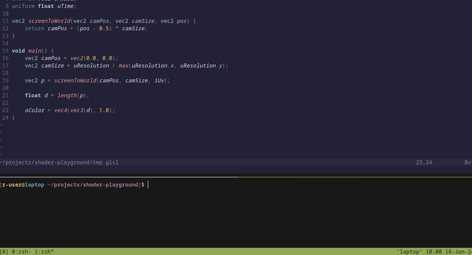

# Shader Playground
A program for locally developing and iterating over shaders. Think of this as a local version of `ShaderToy`.



## Usage
Run the program:
```sh
cargo run --release
```
- This will open an empty window. Simply drag and drop fragment shader files onto it.

Alternatively, you can provide a file directly:
```sh
cargo run --release -- <my-shader.glsl>
```
For more info, consult the help command:
```sh
cargo run --release -- --help
```

## Features
- [x] Hot reloading
- [x] Uniforms
- [x] Window events
- [ ] Custom uniforms
- [x] Drag and drop
- [ ] UI
    - [ ] Uniform sliders
    - [ ] Shader debugging
        - [ ] FPS chart
- [ ] Record to GIF
